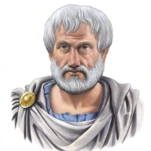

  
- Knowing yourself is the beginning of all wisdom.
- What is a friend? A single soul dwelling in two bodies.
- It is the mark of an educated mind to be able to entertain a thought without accepting it.
- Educating the mind without educating the heart is no education at all!
  
- > Hope is a waking dream.
- No great mind has ever existed without a touch of madness.
- Happiness depends upon ourselves.
- Anybody can become angry — that is easy, but to be angry with the right person and to the right degree and at the right time and for the right purpose, and in the right way — that is not within everybody's power and is not easy.
  
- Excellence is never an accident. It is always the result of high intention, sincere effort, and intelligent execution; it represents the wise choice of many alternatives - choice, not chance, determines your destiny.
- Wishing to be friends is quick work, but friendship is a slow ripening fruit.
- A friend to all is a friend to none.
- Happiness is the meaning and the purpose of life, the whole aim and end of human existence.
  
- Those who educate children well are more to be honored than they who produce them; for these only gave them life, those the art of living well.
- Patience is bitter, but its fruit is sweet.
- To perceive is to suffer.
- Those who know, do. Those that understand, teach
- He who has overcome his fears will truly be free.
  
- The educated differ from the uneducated as much as the living differ from the dead.
- Whosoever is delighted in solitude, is either a wild beast or a god.
- I count him braver who overcomes his desires than him who conquers his enemies, for the hardest victory is over self.
- Poverty is the parent of revolution and crime.
The aim of art is to represent not the outward appearance of things, but their inward significance.
  
- It is not enough to win a war; it is more important to organize the peace.
- The antidote for fifty enemies is one friend.
- The high-minded man must care more for the truth than for what people think.
- Pleasure in the job puts perfection in the work.
  
- To write well, express yourself like the common people, but think like a wise man.
- One swallow does not make a summer, neither does one fine day; similarly one day or brief time of happiness does not make a person entirely happy.
- Learning is not child's play; we cannot learn without pain.
- The whole is greater than the sum of its parts.
  
- > Man is by nature a social animal; an individual who is unsocial naturally and not accidentally is either beneath our notice or more than human. Society is something that precedes the individual. Anyone who either cannot lead the common life or is so self-sufficient as not to need to, and therefore does not partake of society, is either a beast or a god. 